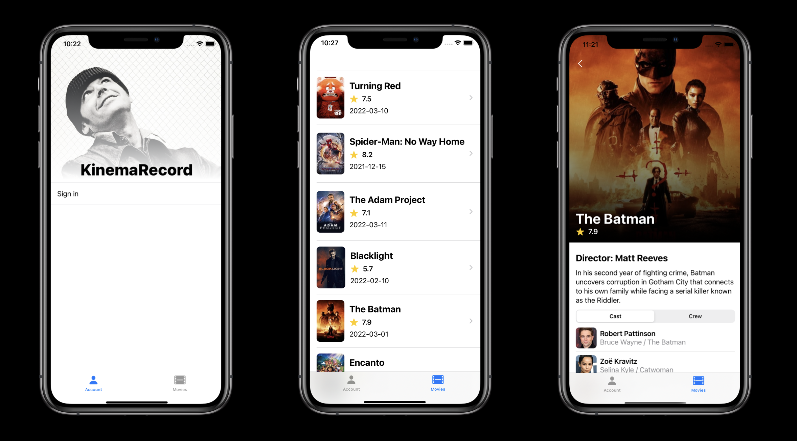
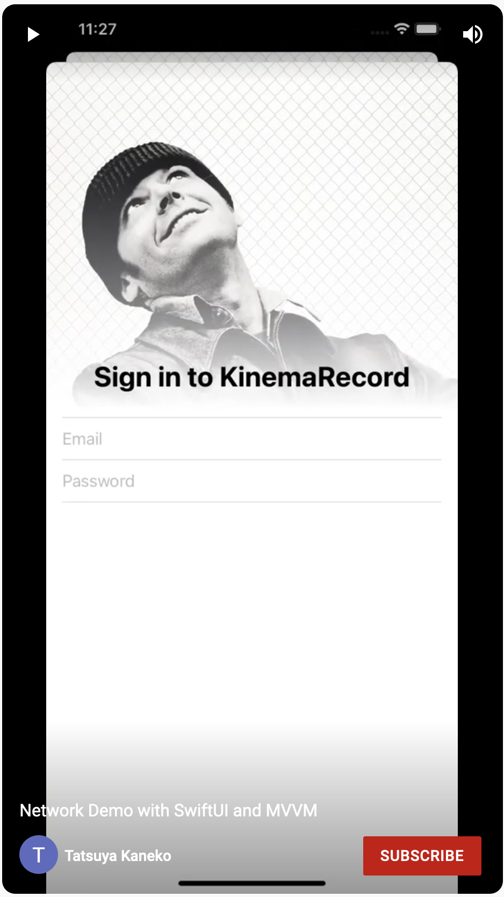

# Network Demo

An app to demostrate how network calls can be implemented in a SwiftUI/MVVM app.

## Motivations

Apple's introductory tutorial is a great starting point to learn about SwiftUI (https://developer.apple.com/tutorials/swiftui). However, it doesn't cover many things that an app in a production app would need:

- Network calls
  - Being able to communicate with many endpoints without code duplication
  - Concurrency
    - Network calls that depends on the other calls' results
  - Error handling
- Logging
- Navigation
- Test

When I tried to extend my app after finishing the tutorial, I still had to make many decisions about how to organise the codebase. I thought it could be useful for myself and other people who are new to SwiftUI, if I implement the app with network calls with a more realistic app architecture with basic tests and logging.

## Disclaimer

The main purpose of the app is to demostrate how an app can be structured. It is not an app with a full functionality.

## Features

- Login (You can login with a TMDB account. You can create an accout at: https://www.themoviedb.org/signup)
- Logout
- Display a list of popular films
- Display a details of a movie
  - browse casts
  - browse crew

## Demo video:
Click to play:

